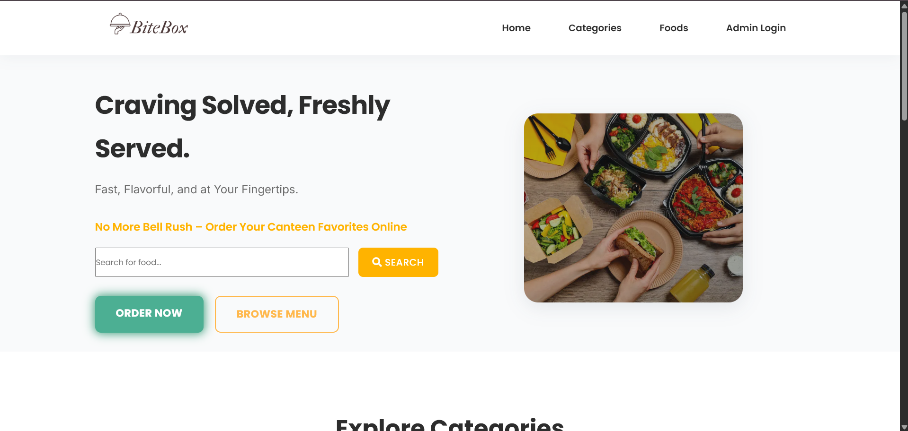
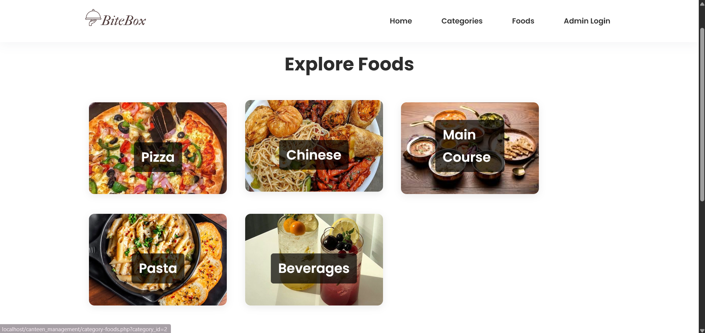
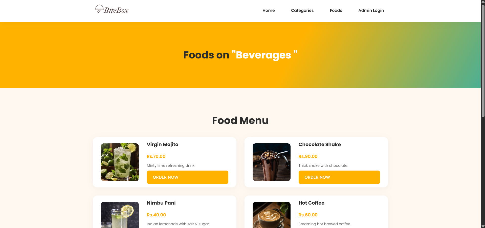
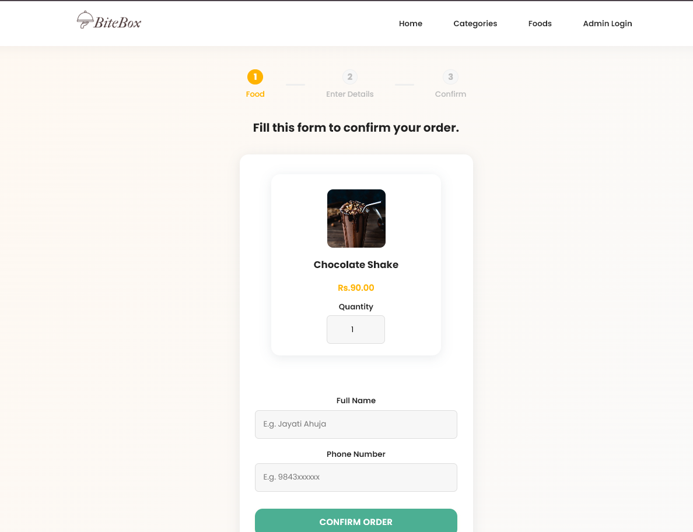
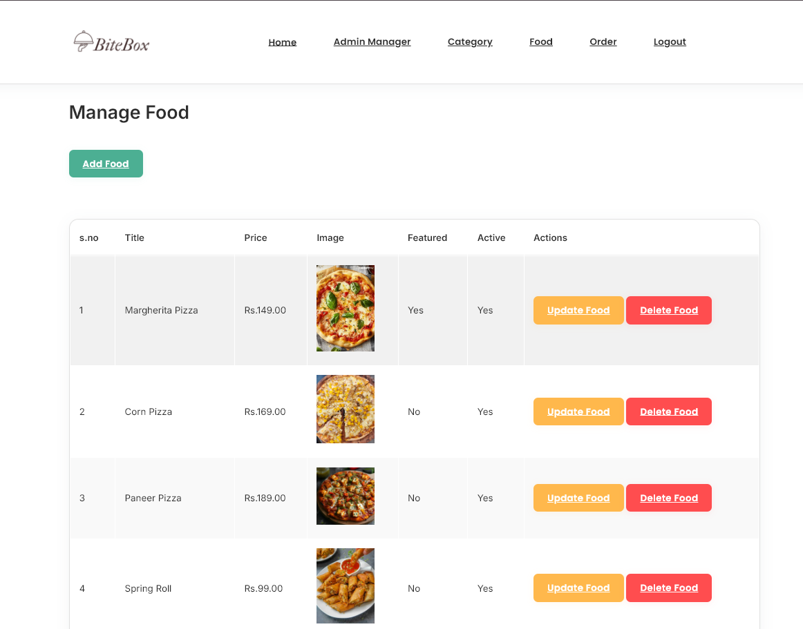
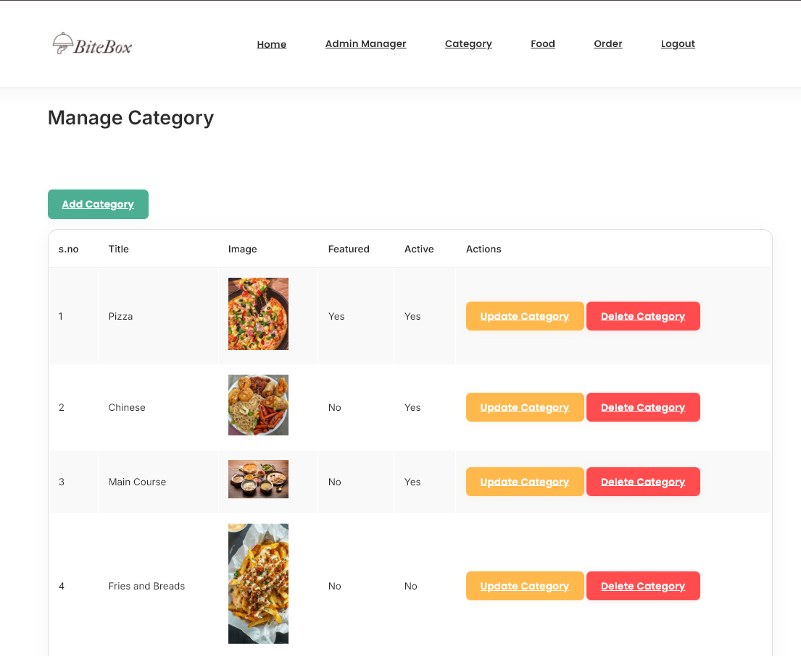
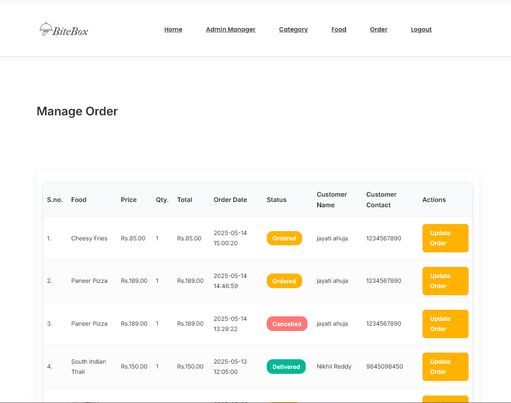
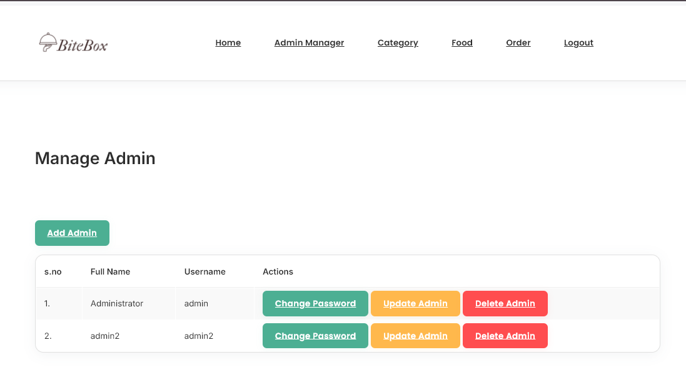

# 🍽️ Canteen Management System

A modern web-based Canteen Management System built with PHP and MySQL, featuring a responsive user interface for food ordering and a comprehensive admin dashboard for efficient management.



## 📋 Table of Contents
- [Features](#-features)
- [Screenshots](#-screenshots)
- [Project Structure](#-project-structure)
- [Database Setup](#-database-setup)
- [Advanced Database Features](#-advanced-database-features)
- [Installation & Setup](#-installation--setup)
- [Image Management](#-image-management)
- [Usage Guide](#-usage-guide)
- [Customization](#-customization)
- [Contributing](#-contributing)
- [License](#-license)

## ✨ Features

### 👤 User Side
- **Browse Menu:** View food categories and featured dishes
- **Search Foods:** Quick search functionality with filters
- **Order Online:** Easy-to-use order placement system
- **Responsive UI:** Mobile-friendly interface
- **Order Tracking:** Real-time order status updates

### 👨‍💼 Admin Side
- **Secure Authentication:** Protected admin access
- **Dashboard Analytics:** Sales, orders, and revenue insights
- **Category Management:** Full CRUD operations for food categories
- **Food Management:** Comprehensive food item management
- **Order Management:** Track and update customer orders
- **Admin Management:** User access control
- **Password Security:** Secure password management

## 📸 Screenshots

### User Interface

#### Homepage

*The main landing page featuring featured foods, categories, and quick access to menu*

#### Category/Explore Food Page

*Explore food items by categories with filtering options and detailed food information*

#### Menu Page

*Browse through all available food items with categories and search functionality*

#### Order Page

*User-friendly order placement interface with cart management*

### Admin Dashboard

#### Dashboard Overview

*Admin dashboard with key metrics, recent orders, and quick actions*

#### Food Management

*Comprehensive food item management interface with CRUD operations*

#### Category Management

*Category management system for organizing food items*

#### Order Management

*Order tracking and management system for administrators*

#### Admin Management

*Admin user management interface for creating, updating, and deleting administrator accounts. Features include adding new admins, changing passwords, updating usernames, and managing admin access rights.*

## Project Structure

```
canteen_management/
│
├── admin/                # Admin dashboard and management pages
│   ├── add-admin.php
│   ├── manage-admin.php
│   ├── manage-category.php
│   ├── manage-food.php
│   ├── manage-order.php
│   └── ... (other admin features)
│
├── config/               # Configuration files
│   └── constants.php
│
├── css/                  # Stylesheets
│   ├── admin.css
│   └── style.css
│
├── images/               # Image assets
│
├── partials-front/       # Frontend reusable components
│   ├── menu.php
│   └── footer.php
│
├── index.php             # Main landing page (user side)
├── foods.php             # All foods listing
├── order.php             # Food order form
├── food-search.php       # Search results
├── category-foods.php    # Foods by category
├── categories.php        # Category listing
│
├── database_setup.sql    # SQL script to set up the database
└── README.md             # Project documentation
```

## Database Setup

1. **Create the Database:**
   - Import the `database_setup.sql` file into your MySQL server.
   - This will create the database, tables, and a default admin user:
     - **Username:** `admin`
     - **Password:** `admin12345`

2. **Database Tables:**
   - `tbl_admin`: Admin users
   - `tbl_category`: Food categories
   - `tbl_food`: Food items
   - `tbl_order`: Customer orders

## Advanced Database Features

### Triggers
- **before_category_delete:** Prevents deletion of a category if it still has foods assigned. If you try to delete such a category, the operation is blocked and a clear error message is shown.
- **after_order_update:** Logs every change in order status to the `tbl_order_status_log` table, recording the old and new status and the time of change.

### Procedures
- **get_daily_sales:** Returns the total number of orders and total revenue for a given date. Usage example:
  ```sql
  CALL get_daily_sales('2024-05-20');
  ```

## Installation & Setup

1. **Clone the Repository:**
   ```bash
   git clone <repository-url>
   ```

2. **Configure Database Connection:**
   - Edit `config/constants.php` to set your database host, username, password, and database name.

3. **Set Up Web Server:**
   - Place the project folder in your web server's root directory (e.g., `htdocs` for XAMPP).
   - Ensure PHP and MySQL are running.

4. **Import Database:**
   - Use phpMyAdmin or MySQL CLI to import `database_setup.sql`.

5. **Access the Application:**
   - User Side: `http://localhost/canteen_management/index.php`
   - Admin Side: `http://localhost/canteen_management/admin/login.php`

## 🖼️ Image Management

### Supported Image Types
- JPG/JPEG
- PNG
- WebP (recommended for better performance)

### Image Guidelines
1. **Food Images:**
   - Recommended size: 800x600 pixels
   - Maximum file size: 2MB
   - Format: WebP (preferred) or JPG
   - Location: `images/food/`

2. **Category Images:**
   - Recommended size: 400x300 pixels
   - Maximum file size: 1MB
   - Format: WebP (preferred) or PNG
   - Location: `images/category/`

3. **Banner Images:**
   - Recommended size: 1920x600 pixels
   - Maximum file size: 3MB
   - Format: WebP (preferred) or JPG
   - Location: `images/banner/`

### Adding Images
1. Place your images in the appropriate directory
2. Use descriptive filenames (e.g., `chicken-burger.webp`)
3. Optimize images before uploading for better performance
4. Ensure proper permissions (readable by web server)

### Image Optimization Tips
- Use WebP format for better compression
- Compress images using tools like TinyPNG
- Maintain aspect ratios
- Use appropriate image sizes for different devices

## Usage Guide

### User Side
- Browse menu and categories
- Search for specific foods
- Place orders with cart management
- Track order status

### Admin Side
- Log in to admin dashboard
- Manage food categories and items
- Process and track orders
- Manage admin accounts
- View sales analytics

## Customization

- **Images:** Add your food and category images in the `images/` directory
- **Styles:** Modify `css/style.css` and `css/admin.css` for custom styles
- **Configuration:** Update `config/constants.php` for database and other settings

## 🤝 Contributing

We welcome contributions! Please follow these steps:

1. Fork the repository
2. Create a feature branch
3. Commit your changes
4. Push to the branch
5. Create a Pull Request

### Development Guidelines
- Follow PSR-12 coding standards
- Write meaningful commit messages
- Update documentation for new features
- Test thoroughly before submitting PRs

## 📄 License

This project is licensed under the MIT License - see the [LICENSE](LICENSE) file for details.

---

Made with ❤️ by Jayati Ahuja .

*For support or questions, please open an issue in the repository.*

