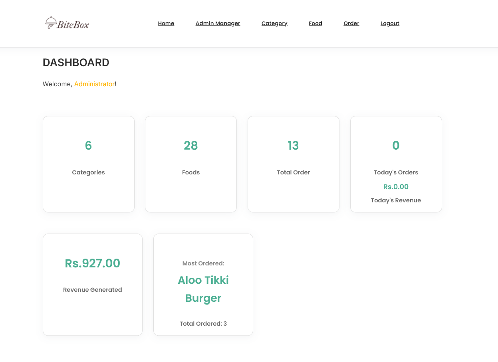

# 🍽️ Canteen Management System

A modern web-based Canteen Management System built with PHP and MySQL, featuring a responsive user interface for food ordering and a comprehensive admin dashboard for efficient management.


##  Table of Contents

- [Features](#features)
- [Project Structure](#project-structure)
- [Database Setup](#database-setup)
- [Advanced Database Features](#advanced-database-features)
- [Installation & Setup](#installation-&-setup)
- [Usage](#usage)
- [Customization](#customization)
- [License](#license)

## Features

### User Side
- **Browse Menu:** View food categories and featured dishes.
- **Search Foods:** Quickly find foods using the search bar.
- **Order Online:** Place orders for available foods.
- **Responsive UI:** Clean and modern interface for easy navigation.

### Admin Side
- **Admin Authentication:** Secure login/logout for admins.
- **Dashboard:** Overview of categories, foods, orders, and revenue.
- **Category Management:** Add, update, delete, and manage food categories.
- **Food Management:** Add, update, delete, and manage food items.
- **Order Management:** View, update, and track customer orders.
- **Admin Management:** Add, update, and delete admin users.
- **Password Management:** Update admin passwords securely.

## Project Structure

```
canteen_management/
│
├── admin/                # Admin dashboard and management pages
│   ├── add-admin.php
│   ├── manage-admin.php
│   ├── manage-category.php
│   ├── manage-food.php
│   ├── manage-order.php
│   └── ... (other admin features)
│
├── config/               # Configuration files
│   └── constants.php
│
├── css/                  # Stylesheets
│   ├── admin.css
│   └── style.css
│
├── images/               # Image assets
│
├── partials-front/       # Frontend reusable components
│   ├── menu.php
│   └── footer.php
│
├── index.php             # Main landing page (user side)
├── foods.php             # All foods listing
├── order.php             # Food order form
├── food-search.php       # Search results
├── category-foods.php    # Foods by category
├── categories.php        # Category listing
│
├── database_setup.sql    # SQL script to set up the database
└── README.md             # Project documentation
```

## Database Setup

1. **Create the Database:**
   - Import the `database_setup.sql` file into your MySQL server.
   - This will create the database, tables, and a default admin user:
     - **Username:** `admin`
     - **Password:** `admin12345`

2. **Database Tables:**
   - `tbl_admin`: Admin users
   - `tbl_category`: Food categories
   - `tbl_food`: Food items
   - `tbl_order`: Customer orders

## Advanced Database Features

### Triggers
- **before_category_delete:** Prevents deletion of a category if it still has foods assigned. If you try to delete such a category, the operation is blocked and a clear error message is shown.
- **after_order_update:** Logs every change in order status to the `tbl_order_status_log` table, recording the old and new status and the time of change.

### Procedures
- **get_daily_sales:** Returns the total number of orders and total revenue for a given date. Usage example:
  ```sql
  CALL get_daily_sales('2024-05-20');
  ```

## Installation & Setup

1. **Clone the Repository:**
   ```bash
   git clone <repository-url>
   ```

2. **Configure Database Connection:**
   - Edit `config/constants.php` to set your database host, username, password, and database name.

3. **Set Up Web Server:**
   - Place the project folder in your web server's root directory (e.g., `htdocs` for XAMPP).
   - Ensure PHP and MySQL are running.

4. **Import Database:**
   - Use phpMyAdmin or MySQL CLI to import `database_setup.sql`.

5. **Access the Application:**
   - User Side: `http://localhost/canteen_management/index.php`
   - Admin Side: `http://localhost/canteen_management/admin/login.php`

## Usage

- **User Side:** Browse menu, search for foods, and place orders.
- **Admin Side:** Log in as admin to manage categories, foods, orders, and other admins.

## Customization

- **Images:** Add your food and category images in the `images/` directory.
- **Styles:** Modify `css/style.css` and `css/admin.css` for custom styles.

## License

This project is for educational purposes.

## 📸 Screenshots

### User Interface

#### Homepage

*The main landing page featuring featured foods, categories, and quick access to menu*

#### Category/Explore Food Page

*Explore food items by categories with filtering options and detailed food information*

#### Menu Page

*Browse through all available food items with categories and search functionality*

#### Order Page

*User-friendly order placement interface with cart management*

### Admin Dashboard

#### Dashboard Overview

*Admin user management interface for creating, updating, and deleting administrator accounts. Features include adding new admins, changing passwords, updating usernames, and managing admin access rights.*

#### Dashboard Overview

*Admin dashboard with key metrics, recent orders, and quick actions*

#### Food Management

*Comprehensive food item management interface with CRUD operations*

#### Category Management

*Category management system for organizing food items*

#### Order Management

*Order tracking and management system for administrators*

Feel free to further customize this README with your project's specific details, screenshots, or deployment instructions!
